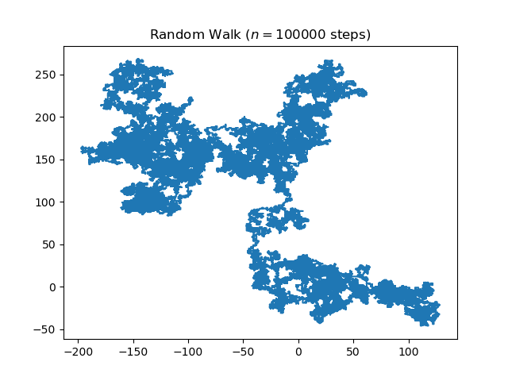

# Random Walk Simulation

This is a **group exercise**, so you should be working in pairs of two students. It's **30% of your final grade**. 

The Goal is to **practise writing readable, maintainable and reliable code collaboratively.**

## Group Exercise

1. One student of your group forks the code from [https://github.com/advanced-geoscripting-2021/random_walker.git](https://github.com/advanced-geoscripting-2021/random_walker.git)

2. This student invites the other student as a collaborator to the forked repository. Now you can both work on the code.

3. Adapt the code to fulfil the requirements (see below).

4. Code review: Each group reviews the code of another group. 

5. Improve your code based on the review you got. 

## Write an extended random walk program 

In this repo you find a basic implementation of a [random walk simulation](https://en.wikipedia.org/wiki/Random_walk) in 2-dimensional space taken from [this blogpost](https://www.geeksforgeeks.org/random-walk-implementation-python/). Running the code yields an image which shows the path of the random walk. 

The program works but it is not very readable. In addition, you should **extend the program based on the requirements listed below.

**Remember to apply the best practices in scientific computing** to make the code more readable, maintainable, reusable and efficient.  

### Minimum requirements: 

Extend the program so the following requirements are met:

1. The program should be able to simulate multiple random walkers. 
2. The program should be executable from the command line. 
3. The user should be able to specify the number of random walkers through a command line parameter. 
4. Document the dependencies and instructions of how to run the program in your README.md.

### Additional requirements: 

1. Create three different types of walkers, e.g. a "fast walker" which has a bigger step size. 
2. Add a "landscape" in which the random walkers are walking in which contains obstacles which the walkers cannot cross (e.g. a lake)
3. Invent and implement another functionality of your own.

Be creative here! :) 

## Code Review 

Review the code of another group: (tuesday afternoon or wednesday morning)

1. Does it work properly? Try to make it fail!
2. Are the best-practices implemented in the code?
3. Is the documentation clear? 
4. Can you adapt the code easily? E.g. try to create a new type of random walker which moves two cells per iteration.  

